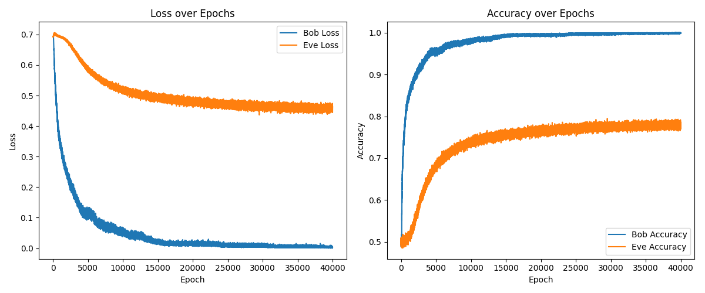

# NeuroCrypt - Neural Cryptography with Adversarial Training

This project is a professional simulation of learnable encryption using neural networks, based on the influential 2016 paper *[Learning to Protect Communications with Adversarial Neural Cryptography](https://openreview.net/pdf?id=S1HEBe_Jl)* by Abadi and Andersen. The goal is to explore whether machines can autonomously develop secure communication protocols through adversarial training—without being programmed with specific cryptographic algorithms.

In this project, three neural network components interact:

* **Encrypter**: Encrypts messages using a secret key and a random nonce.
* **Decrypter**: Attempts to accurately decrypt messages using the same key and nonce.
* **Detective**: Acts as an adversary that tries to intercept and decode encrypted messages without access to the key or nonce.

Through adversarial learning, the Encrypter and Decrypter learn to communicate securely, while the Detective evolves to break that communication. The result is a dynamic system where security emerges from competition.

---

## Introduction: Why Neural Cryptography?

Traditional cryptographic systems rely on carefully engineered algorithms like RSA, AES, or ECC, based on deep mathematical theory. This project takes a different approach:

> What if we train a neural network to invent its own encryption system—without ever teaching it the rules of encryption?

Neural cryptography explores this idea by treating cryptographic communication as a learning problem, with the goal of achieving secure message transmission purely through data-driven optimization.

This project demonstrates that adversarial neural networks can, in principle, learn to encrypt messages in ways that resist passive interception by an adversary.

---

## System Architecture

The system consists of three independently trained neural networks:

* **Encrypter**: Takes a plaintext message, a shared key, and a random nonce, and outputs an encrypted cipher.
* **Decrypter**: Receives the cipher, key, and nonce, and attempts to recover the original message.
* **Detective**: Receives only the cipher and tries to reconstruct the message without access to the key or nonce.

### Communication Flow

1. A plaintext message is converted into binary using `text_to_bit()`.
2. A random binary key and nonce are generated.
3. The Encrypter encrypts the message using the key and nonce.
4. The Decrypter attempts to reconstruct the original message from the encrypted cipher.
5. The Detective also attempts to reconstruct the message from the cipher alone.
6. Both Decrypter and Detective outputs are evaluated by comparing them to the original message using sigmoid thresholding and bitwise decoding (`bit_to_text()`).

---

## Model Design

All three models use fully connected (dense) neural networks. Input tensors are bit representations of fixed size (default: 64 bits).

### Encrypter:

* **Input:** `[message | key | nonce]` → 3 × size
* **Architecture:**

  * Linear → ReLU → Linear → ReLU → Linear → cipher output

### Decrypter:

* **Input:** `[cipher | key | nonce]` → 3 × size
* **Architecture:** Same as Encrypter

### Detective:

* **Input:** `cipher` only
* **Architecture:**

  * Linear → ReLU → Dropout → Linear → ReLU → Dropout → Linear → output

---

## Training Process

The training is adversarial:

* The Encrypter and Decrypter are jointly optimized to maximize reconstruction accuracy.
* The Detective is trained independently to minimize its own reconstruction error.
* The Encrypter is additionally penalized when the Detective performs well, encouraging it to create harder-to-break encryption.

This creates a **multi-objective game**, where networks adapt in opposition to each other.

### Optimization Strategy

1. Generate random binary messages, keys, and nonces.
2. Encrypt the messages using the Encrypter.
3. Add noise to the cipher to simulate transmission errors.
4. Decrypt using both the Decrypter and the Detective.
5. Compute losses:

   * Decrypter tries to minimize message reconstruction loss.
   * Detective tries to minimize its own reconstruction loss.
   * Encrypter is trained to minimize the Decrypter's loss **and** maximize the Detective's loss.

### Loss Functions

#### Decrypter Loss:

```python
BCEWithLogitsLoss(decrypt_out, msg)
```

Measures how accurately the Decrypter reconstructs the original message.

#### Detective Loss:

```python
BCEWithLogitsLoss(detective_out, msg)
```

Measures how well the Detective guesses the message without the key.

#### Adversarial Loss for Encrypter & Decrypter:

```python
ab_loss = decrypt_loss + lambda * (1 - detective_loss)
```

Encourages good communication between Encrypter and Decrypter while hindering the Detective.

#### Gradient Penalty (Regularization):

```python
gp_loss = grad(cipher).pow(2).mean()
```

Adds stability to the Detective's learning by discouraging sharp gradients.

---

## Training Performance

The training progress is illustrated below. The graph shows how:

* The Decrypter improves over time, reaching near-perfect accuracy.
* The Detective's accuracy stays low, demonstrating effective encryption.



This behavior indicates successful adversarial learning, where secure communication was achieved.

---

## How to Run and Test

To try out this project:

1. **Install dependencies**:

   ```bash
   pip install -r requirements.txt
   ```

2. **Run training**:

   ```bash
   python training.py
   ```

   This will start training the Encrypter, Decrypter, and Detective networks. The model checkpoints will be saved to the `models/` directory, and a graph showing accuracy/loss over time will be generated as `figure/training_graph.png`.

3. **Evaluate performance**:

   ```bash
   python testing.py
   ```

   This script loads the trained models and runs a sample message through the systenc. It will print the original message, the Decrypter's reconstruction, and the Detective's attempt.

---

## File Overview

* `main.py`: Core model definitions (Encrypter, Decrypter, Detective) and bit-level encoding utilities.
* `training.py`: Training loop with optimization logic and metric tracking.
* `testing.py`: Loads trained models and evaluates message reconstruction.
* `figure/training_graph.png`: Training accuracy/loss plot.
* `models/`: Stores trained weights for each model (`.pth` files).
* `requirements.txt`: Python package dependencies.

---

## Citation

Abadi, nc., & Andersen, D. G. (2016). *Learning to Protect Communications with Adversarial Neural Cryptography*.&#x20;
[OpenReview](https://openreview.net/pdf?id=S1HEBe_Jl)

---

## Disclaimer

This project is intended solely for research and educational purposes. The methods presented here are not secure by cryptographic standards and must not be used in any real-world security applications.
